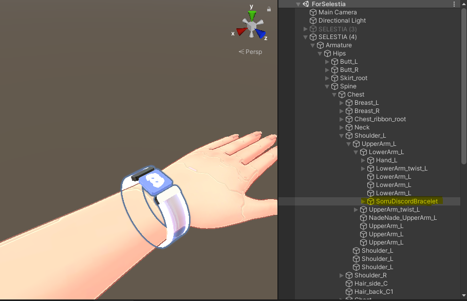
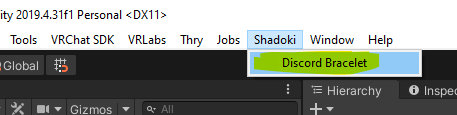
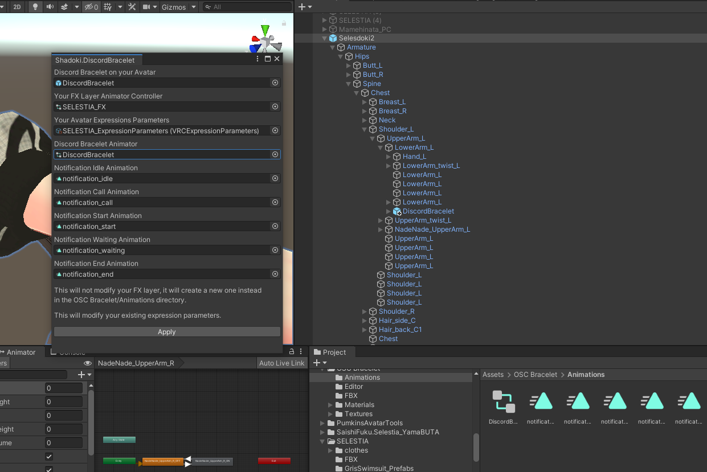

# vrc-discord-osc

A python application for VRChat players to receive discord notifications on their avatar via OSC

## Credits

- Application - Shadoki
- Bracelet Model - Sorru
- Shader Configuration - Harumodoki
- [Avatars 3.0 Manager](https://github.com/VRLabs/Avatars-3.0-Manager) - For the animator merging script

## Table of Contents

- [Installation](#installation)
- [Contributing](#contributing)
- [Setting up your avatar](#setting-up-your-avatar)

## Installation

---

Head over to the [Releases](https://github.com/uzair-ashraf/vrc-osc-discord-band/releases) page to get the latest release.

- Download the executable and run it after you start VRChat.
- Download the Unity Package and add the Prefab to your avatar. ([More Instructions](#setting-up-your-avatar) on this below)

## Contributing

---

### Requirements

- Python 3.10.9
- Windows 10
- pip

1. Clone the repository

   ```shell
   git clone git@github.com:uzair-ashraf/vrc-osc-discord-band.git
   cd vrc-osc-discord-band
   ```

1. Install Dependencies

   ```shell
   pip install -r requirements.txt
   ```

1. Run

   ```shell
   python main.py
   ```

1. Build a standalone executable

   This repository is setup with a Github action to compile the standalone executable. If you would like to compile it on your local machine you can read the action for the command via `pyinstaller` [here](./.github/workflows/release.yml).

### Setting up your avatar

---

If this your first time working with OSC head over to the [VRChat docs to learn more](https://docs.vrchat.com/docs/osc-overview).

This doc assumes you have a Unity Package with an avatar already set up to be published to VRChat along with some knowledge of how to use Unity.

1. Head over to the [releases](https://github.com/uzair-ashraf/vrc-osc-discord-band/releases) page and download the unity package from the latest release.

1. Open your Unity Project with your avatar.

1. Download the Poiyomi Shader and import it into your project: https://github.com/poiyomi/PoiyomiToonShader/releases

1. Import the unity package from the latest release.

1. If the materials in `Assets/OSC Bracelet/MAT` are purple, set them all to Poiyomi and the settings should transfer

1. Place the prefab in your scene

1. Move the prefab into your armature as a child of your lower left arm bone and adjust it's scale/position to fit your avatar:

   <p align="center">
      
   </p>

1. In your tool bar click `Shadoki > Discord Bracelet`

   <p align="center">
      
   </p>

1. Add the Discord Bracelet, Controllers, and Animations into the editor window and press `Apply`. Keep an eye in the debug console for possible errors.

   <p align="center">
      
   </p>

1. Your new FX layer should be present in `OSC Bracelet/Animations`. Drag and drop it into your avatar's FX Layer.

1. If you are having trouble getting the OSC program to communicate with VRChat, checkout this troubleshooting doc that Wizard wrote for their TTS App: https://github.com/VRCWizard/TTS-Voice-Wizard/wiki/OSC-Troubleshooting
